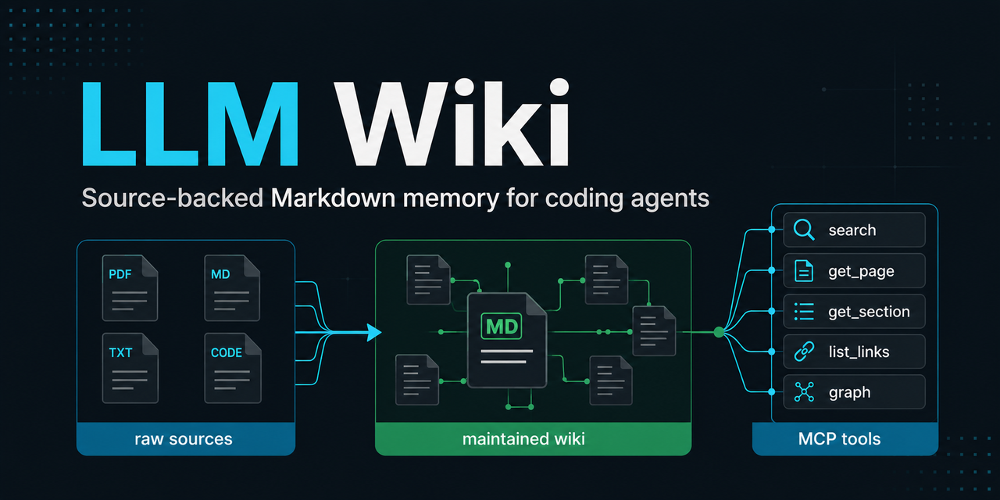

# LLM Wiki

[](https://github.com/codingfeng-fufu/agent-wiki/actions/workflows/ci.yml)
[](https://www.python.org/downloads/)
[](LICENSE)

Local, source-backed Markdown memory for coding agents.

LLM Wiki is a runnable implementation of Andrej Karpathy's
[LLM Wiki pattern](https://gist.github.com/karpathy/442a6bf555914893e9891c11519de94f):
keep raw sources as immutable evidence, let an agent maintain a connected
Markdown wiki in front of them, and use that wiki as the durable knowledge layer
for future work.



This is not a hosted knowledge base and not another query-time RAG wrapper. It
is a local-first developer tool for agents that need memory across sessions:
source pages, concept pages, links, provenance, search, MCP tools, safe plans,
dry-run apply, and health checks.

It is an independent project, not an official project from Andrej Karpathy,
OpenAI, Anthropic, the Model Context Protocol project, qmd, Obsidian, or any
other referenced tool. See [Origin](docs/origin.md).

## Why Not Just RAG?

Query-time RAG retrieves raw chunks every time a user asks a question. That is
useful, but it does not naturally accumulate structure.

LLM Wiki uses a compile-first workflow:

```text
raw sources -> maintained wiki -> agent tools
```

The agent reads sources once, writes durable Markdown pages, connects related
concepts, records provenance, and reuses the maintained wiki through CLI or MCP
tools. New questions can also become saved wiki pages, so the knowledge base
improves instead of disappearing into chat history.

Read more in [Why Not Just RAG?](docs/why-not-just-rag.md) and
[Karpathy Pattern Compatibility](docs/karpathy-pattern.md).

## Quick Start

This first public version is optimized for local use from a GitHub clone.

```bash
git clone https://github.com/codingfeng-fufu/agent-wiki.git
cd agent-wiki
uv sync --extra dev
```

Check the included example wiki:

```bash
uv run llmw context --root . --json
uv run llmw search "prompt injection tool safety" --root . --limit 3 --json
uv run llmw health check --root . --json
```

Run the proof demo:

```bash
scripts/demo.sh
```

The demo does not edit tracked wiki content. It prints project context, searches
the maintained wiki, creates a local ignored plan file, dry-runs the plan, and
finishes with a structural health check.

In the included example wiki, a healthy checkout reports `48` wiki pages,
`8` ingested sources, a current index, and no structural health issues.

## Who This Is For

LLM Wiki is for coding and research agents working across more than one chat:
agent framework research, project documentation, source-backed design notes,
security reviews, and other workflows where knowledge should accumulate.

It is not a hosted SaaS product, a consumer note-taking app, a generic vector
database wrapper, or a replacement for Obsidian. The Markdown wiki stays local,
diffable, and reviewable.

## What It Manages

```text
raw/      immutable evidence: Markdown, text, and PDF sources
wiki/     maintained Markdown pages with summaries, links, and provenance
system/   prompts, templates, provider configs, and project rules
.llmw/    local state: source registry, plans, sessions, caches, and secrets
```

The normal loop:

```text
add source -> create ingest packet -> agent updates wiki -> record ingest
search/query wiki -> plan safe changes -> dry-run apply -> health check
```

## Try The Included Wiki

This repository includes a working example wiki about agent development, so a
visitor can inspect the pattern without adding private data first.

Useful pages:

- [Agent development knowledge map](wiki/analyses/agent-development-knowledge-map.md)
- [Prompt Injection](wiki/concepts/prompt-injection.md)
- [Model Context Protocol](wiki/concepts/model-context-protocol.md)
- [Tool Safety](wiki/concepts/tool-safety.md)

Useful commands:

```bash
uv run llmw search "MCP tools resources prompts" --root . --json
uv run llmw search "durable execution checkpointing" --root . --json
uv run llmw benchmark search --root . --provider python --top-k 5 --json
```

See [Examples](examples/README.md) and [Demo](docs/demo.md).

## Build Your Own Wiki

Place Markdown, text, or PDF source material under `raw/inbox/`, then register
it:

```bash
uv run llmw source add raw/inbox/example.md --root . --json
uv run llmw source list --root . --json
```

Create an ingest packet for an agent:

```bash
uv run llmw ingest packet <source_id> --root .
```

The packet contains source text, expected wiki edits, and operating rules. Give
that packet to your coding agent, let it update `wiki/`, then record the ingest:

```bash
uv run llmw ingest record <source_id> \
  --page wiki/sources/<source_id>.md \
  --root . \
  --json
```

Verify the result:

```bash
uv run llmw index rebuild --root . --json
uv run llmw health check --root . --json
```

For a fuller walkthrough, see [Quickstart](docs/quickstart.md).

## Use With An Agent

Start the MCP server:

```bash
uv run llmw mcp --root .
```

Agent runtimes should use MCP as the primary interface:

1. Call `llmw_context` before project work.
2. Use `llmw_search` before answering or editing.
3. Use `llmw_query` when an answer should be synthesized from wiki evidence.
4. Use `llmw_plan` for safe write planning.
5. Use `llmw_apply` with `dry_run: true` before applying a plan.
6. Run `llmw_health_check` before considering maintenance complete.

Common MCP tools:

- `llmw_context`
- `llmw_next`
- `llmw_maintain`
- `llmw_health_check`
- `llmw_search`
- `llmw_query`
- `llmw_plan`
- `llmw_apply`
- `llmw_benchmark_search`

For Codex:

```bash
uv run llmw integration codex install --root . --json
uv run llmw integration codex test --root . --json
```

See [MCP integration](docs/mcp.md) and
[Agent loop example](examples/agent-loop.md).

## LLM Provider Support

Search, context, health checks, planning dry-runs, and the local demo work
without an API key.

LLM-backed commands use provider JSON under `system/providers/` and local
secrets from environment variables or `.llmw/.env`. The default generated
provider config uses Qwen Plus through DashScope:

```bash
export DASHSCOPE_API_KEY=your-dashscope-api-key
uv run llmw llm check --root . --json
```

Provider-backed commands include:

- `llmw query`
- `llmw ingest run`
- `llmw health audit`
- `llmw maintain` when `--audit` is enabled
- `llmw agent` and `llmw wizard`

Keep `.llmw/.env` private.

## Safety Model

- `raw/` is evidence. Agents should read it, not rewrite it.
- `wiki/` is the maintained knowledge layer.
- `.llmw/` contains local config, caches, sessions, plans, and search state.
- Planned writes use constrained actions and dry-run previews.
- `wiki_patch` rejects absolute paths, path traversal, and writes outside
  allowed project areas.
- Package and release checks audit artifacts so local secrets, qmd databases,
  sessions, plans, and private knowledge-base data do not ship accidentally.

Before publishing your own wiki repository, review `raw/`, `wiki/`, `.llmw/`,
logs, and generated outputs as potentially sensitive data.

## Development Checks

Current public-alpha baseline:

- `141` tests pass locally.
- `llmw health check` reports no structural issues.
- Python search benchmark passes the release gate with `Recall@5` above `0.94`
  and `HitRate@5` above `0.97`.
- Source distribution audit passes and excludes local `.llmw/` state.

```bash
uv run --extra dev pytest -q
uv run llmw health check --root . --json
uv run llmw benchmark search --root . --provider python --top-k 5 --json
uv run llmw release check --root . --sdist --no-codex --no-strict --json
```

Build local package artifacts:

```bash
uv run llmw package build --root . --no-strict --json
```

The first public version is GitHub-clone-first. PyPI publishing is documented as
a later release step in [Publishing](docs/publishing.md).

## Documentation

- [Quickstart](docs/quickstart.md)
- [Karpathy Pattern Compatibility](docs/karpathy-pattern.md)
- [Why Not Just RAG?](docs/why-not-just-rag.md)
- [Demo](docs/demo.md)
- [Examples](examples/README.md)
- [MCP integration](docs/mcp.md)
- [Architecture](docs/architecture.md)
- [Use cases](docs/use-cases.md)
- [Performance notes](docs/performance.md)
- [Origin](docs/origin.md)
- [Publishing checklist](docs/publishing.md)
- [Roadmap](ROADMAP.md)
- [Contributing](CONTRIBUTING.md)
- [Security policy](SECURITY.md)

## Status

LLM Wiki is an alpha-stage local developer tool. The current focus is making the
Karpathy LLM Wiki pattern usable by coding agents through a clean GitHub
project, a reliable MCP contract, safe maintenance workflows, and local search.
