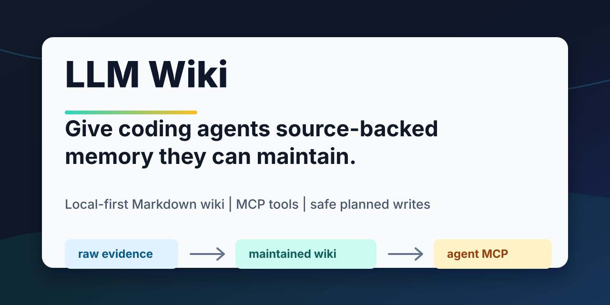

# LLM Wiki

Give your coding agent source-backed memory it can maintain.



LLM Wiki gives coding agents a durable knowledge layer: immutable raw sources,
maintained Markdown wiki pages, fast retrieval, MCP tools, health checks, and
safe planned writes. Instead of asking an agent to rediscover the same raw files
for every question, you let it keep a connected, source-backed wiki that improves
over time.

This repository is an implementation of Andrej Karpathy's LLM Wiki idea:
[llm-wiki.md](https://gist.github.com/karpathy/442a6bf555914893e9891c11519de94f).
It is not an official project from OpenAI, Anthropic, the Model Context
Protocol project, qmd, Obsidian, or any other referenced tool. See
[Origin](docs/origin.md).

```text
Before: your agent searches raw docs again and again.
After:  your agent maintains a source-backed wiki and reuses it through MCP.
```

## Demo

Run the read-only local demo:

```bash
uv sync --extra dev
scripts/demo.sh
```

It shows the core agent loop: project context, wiki search, maintenance planning,
safe apply dry-run, and health verification. See [docs/demo.md](docs/demo.md) for
the full demo flow and recording notes.

This repository also includes a working example wiki about agent development:
[knowledge map](wiki/analyses/agent-development-knowledge-map.md),
[prompt injection](wiki/concepts/prompt-injection.md),
[Model Context Protocol](wiki/concepts/model-context-protocol.md), and
[tool safety](wiki/concepts/tool-safety.md).
It also includes small public raw examples under [raw/examples](raw/examples/README.md)
so visitors can inspect the evidence shape without needing private data.

## Who This Is For

LLM Wiki is for people who use coding agents on work that outlives one chat:

- agent developers building with MCP, tools, guardrails, tracing, and evals
- researchers reading many sources over days or weeks
- engineers who want local project memory instead of another hosted knowledge base
- Obsidian/Markdown users who want an agent to maintain links and summaries
- teams that want source-backed notes with reviewable writes

It is less useful for one-off document Q&A. The value shows up when knowledge
needs to accumulate across sessions.

## Why This Implementation

Karpathy's idea is the important part. This implementation focuses on making the
pattern usable by agents and maintainable as a project:

- MCP-first tools for agent runtimes, not just human CLI commands.
- `context -> search -> query -> plan -> apply` as a repeatable agent loop.
- Safe writes through plan files and dry-run previews.
- Fast local search by default, with optional qmd deep search and daemon reuse.
- Health checks, benchmarks, release gates, package audits, and CI.
- A checked-in example wiki so visitors can inspect real output.

## Why This Exists

Most document workflows are query-time retrieval. You upload files, the model
retrieves fragments, and every new question starts from raw evidence again. That
works, but it does not accumulate much structure.

LLM Wiki uses a different pattern:

```text
raw/ immutable evidence -> wiki/ maintained Markdown -> MCP tools for agents
```

The agent can add source summaries, update concept pages, connect Obsidian-style
`[[links]]`, record provenance, surface contradictions, and save useful answers
back into the wiki. The human still chooses sources and asks better questions.
The agent handles the repetitive maintenance work.

## What You Get

- Local-first Markdown knowledge base under `wiki/`.
- Read-only raw source layer under `raw/`.
- MCP server exposing `llmw_context`, `llmw_search`, `llmw_query`,
  `llmw_plan`, `llmw_apply`, and maintenance tools.
- CLI fallbacks for automation, CI, and agent runtimes without MCP.
- Fast default search using local text retrieval, plus optional qmd deep search.
- Search daemon for repeated high-recall retrieval without cold-start cost.
- Health checks, search benchmarks, release checks, and package audits.
- Codex integration helpers and a reusable local plugin template.

## Quick Start

```bash
uv sync --extra dev
.venv/bin/llmw init
.venv/bin/llmw doctor --json
.venv/bin/llmw mcp --root .
```

Optional qmd deep search support:

```bash
uv sync --extra dev --extra search
```

If you want LLM-backed ingest, query, or semantic audit flows, configure an
OpenAI-compatible provider. The default local project configuration uses Qwen
Plus through DashScope:

```bash
export DASHSCOPE_API_KEY=your-dashscope-api-key
.venv/bin/llmw llm check
```

## End-to-End Example

This repository ships with a small maintained wiki about agent development, so
you can see the workflow without preparing private data first.

Check the project state:

```console
$ .venv/bin/llmw context --root . --json
{
  "ok": true,
  "context": {
    "project_name": "LLM Wiki",
    "wiki": {
      "pages": 48,
      "page_types": {
        "analysis": 1,
        "concept": 39,
        "source": 8
      },
      "index_current": true
    },
    "sources": {
      "total": 8,
      "statuses": {
        "ingested": 8
      },
      "pending_ingest": []
    },
    "health": {
      "errors": 0,
      "warnings": 0,
      "infos": 0,
      "issues": []
    }
  }
}
```

Search the maintained wiki:

```console
$ .venv/bin/llmw search "prompt injection" --root . --limit 3 --json
{
  "ok": true,
  "strategy": {
    "mode": "fast",
    "deep_recommended": false,
    "reason": "Fast rg/Python search is appropriate for exact titles, source lookup, and low-latency agent calls."
  },
  "results": [
    {
      "path": "wiki/concepts/prompt-injection.md",
      "title": "Prompt Injection",
      "provider": "python-scan"
    },
    {
      "path": "wiki/concepts/mcp-prompts.md",
      "title": "MCP Prompts",
      "provider": "python-scan"
    },
    {
      "path": "wiki/sources/03-mcp-tools-resources-prompts-420d2910.md",
      "title": "03 mcp tools resources prompts",
      "provider": "python-scan"
    }
  ]
}
```

Ask an LLM-backed question using only wiki evidence:

```console
$ .venv/bin/llmw query "How should agents handle prompt injection?" --root . --limit 3
Agents should handle prompt injection by ensuring raw source text is treated
strictly as evidence—not as executable instructions—and by applying two key
safeguards:

- Input Guardrails, to distinguish between evidence and commands
  ([Prompt Injection](wiki/concepts/prompt-injection.md)).
- Tool Safety, to limit the actions that injected text can trigger
  ([Prompt Injection](wiki/concepts/prompt-injection.md)).

These measures uphold the principle that raw sources must not override system
or project instructions. The separation of concerns in the Model Context
Protocol—particularly the distinction between tools, resources, and prompts—
supports this defense by design.

Evidence pages:
- Prompt Injection (wiki/concepts/prompt-injection.md)
- MCP Prompts (wiki/concepts/mcp-prompts.md)
- 03 mcp tools resources prompts (wiki/sources/03-mcp-tools-resources-prompts-420d2910.md)

Model: qwen-plus
```

Run the same style of query through a deterministic mock provider for a
reproducible demo:

```console
$ llmw query Agent guardrails 主要解决什么问题？ --root . --provider-config reports/qa-demo/mock-provider.json --limit 3 --max-page-chars 1600
Agent guardrails 用来在输入、输出和工具调用周围建立验证边界，减少不安全输入、格式错误输出和工具滥用风险。相关证据见 Agent Guardrails、Input Guardrails 和 Output Guardrails。

Evidence pages:
- Agent Guardrails (wiki/concepts/agent-guardrails.md)
- 01 openai agents guardrails (wiki/sources/01-openai-agents-guardrails-87ce73bd.md)
- Input Guardrails (wiki/concepts/input-guardrails.md)

Model: mock-qa-model
```

Verify the wiki before handing control back to an agent:

```console
$ .venv/bin/llmw health check --root . --json
{
  "ok": true,
  "issues": []
}
```

Run the full pre-release gate:

```console
$ RUN_LLM_SMOKE=1 ./scripts/release_check.sh

== Tooling ==
llmw 0.1.0
Python 3.11.5

== Tests ==
........................................................................ [ 53%]
..............................................................           [100%]
134 passed in 41.16s

== Offline Health ==
No health issues found.

== Search Benchmark ==
Provider: python
Queries: 102
Top-k: 5
Precision@5: 0.2157
Recall@5: 0.9493
F1@5: 0.3423
HitRate@5: 0.9706
MRR@5: 0.8977

== LLM Smoke ==
Provider: qwen_plus
Model: qwen-plus
Response: OK

== Done ==
Release checks passed.
```

More recorded examples:

- [10 QA terminal examples](reports/qa-demo/ten-qa-report.md)
- [Ingest repair and Chinese search simulation](reports/ingest-simulation-report-2026-05-04.md)
- [Full function test report](reports/function-test/function-test-report-2026-05-04.md)

## Use It With An Agent

Start the MCP server:

```bash
.venv/bin/llmw mcp --root .
```

Then have the agent follow this loop:

1. Call `llmw_context` to understand project state.
2. Use `llmw_search` before answering or editing.
3. Use `llmw_query` when an answer should be synthesized from wiki evidence.
4. Use `llmw_plan` for write operations that can be previewed.
5. Use `llmw_apply` with `dry_run: true` before applying changes.
6. Run `llmw_health_check` before considering maintenance complete.

For Codex:

```bash
.venv/bin/llmw integration codex install --json
.venv/bin/llmw integration codex test --json
```

See [docs/mcp.md](docs/mcp.md) and
[examples/agent-loop.md](examples/agent-loop.md) for the full agent contract.

## Core Workflow

Register a source:

```bash
.venv/bin/llmw source add raw/inbox/example.md
```

Generate an ingest packet for the agent:

```bash
.venv/bin/llmw ingest packet <source_id>
```

After the agent updates `wiki/`, record the source as ingested:

```bash
.venv/bin/llmw ingest record <source_id> --page wiki/sources/<source_id>.md
```

Search and query:

```bash
.venv/bin/llmw search "prompt injection" --json
.venv/bin/llmw query "how should agents handle prompt injection?"
.venv/bin/llmw query "compare MCP and A2A" --save
```

Maintain and verify:

```bash
.venv/bin/llmw maintain --json
.venv/bin/llmw health check --json
.venv/bin/llmw benchmark search --provider python --top-k 5 --json
```

## Performance

Default `search` and `query` use fast local retrieval so normal agent calls stay
responsive. Use deep search only when the `strategy` field says it is useful, or
when high recall matters more than latency.

For repeated deep search, keep the backend warm:

```bash
.venv/bin/llmw search-daemon start --deep
.venv/bin/llmw search-daemon query "guardrails" --json
```

MCP deep search will reuse the daemon when available and otherwise falls back to
a bounded subprocess path. See [docs/performance.md](docs/performance.md).

## Safety Model

- `raw/` is evidence. Agents should read it, not rewrite it.
- `wiki/` is the maintained knowledge layer.
- `.llmw/` contains local config, caches, sessions, plans, and search databases.
- Planned writes use constrained actions and dry-run previews.
- `wiki_patch` rejects absolute paths, path traversal, and writes outside
  allowed project areas.
- Release checks audit package artifacts so local secrets, qmd databases,
  sessions, plans, and private knowledge-base data do not ship accidentally.

Before publishing your own repository, review `raw/`, `wiki/`, `.llmw/`, logs,
and generated outputs as potentially sensitive data.

## Documentation

- [Quickstart](docs/quickstart.md)
- [Demo](docs/demo.md)
- [Architecture](docs/architecture.md)
- [Examples](examples/README.md)
- [Use cases](docs/use-cases.md)
- [MCP integration](docs/mcp.md)
- [Performance notes](docs/performance.md)
- [Launch notes](docs/launch.md)
- [Origin](docs/origin.md)
- [Roadmap](ROADMAP.md)
- [Project philosophy](docs/philosophy.md)
- [Chinese philosophy note](docs/philosophy.zh-CN.md)
- [Publishing checklist](docs/publishing.md)
- [Contributing](CONTRIBUTING.md)
- [Security policy](SECURITY.md)
- [Changelog](CHANGELOG.md)

## Development Checks

```bash
.venv/bin/pytest -q
.venv/bin/llmw health check --json
.venv/bin/llmw benchmark search --provider python --top-k 5 --json
.venv/bin/llmw release check --json
```

Release package build:

```bash
.venv/bin/llmw package build --json
```

## Status

LLM Wiki is an alpha-stage local developer tool. The current focus is the
agent-facing MCP contract, safe maintenance workflows, search latency, and a
clean public packaging story.
