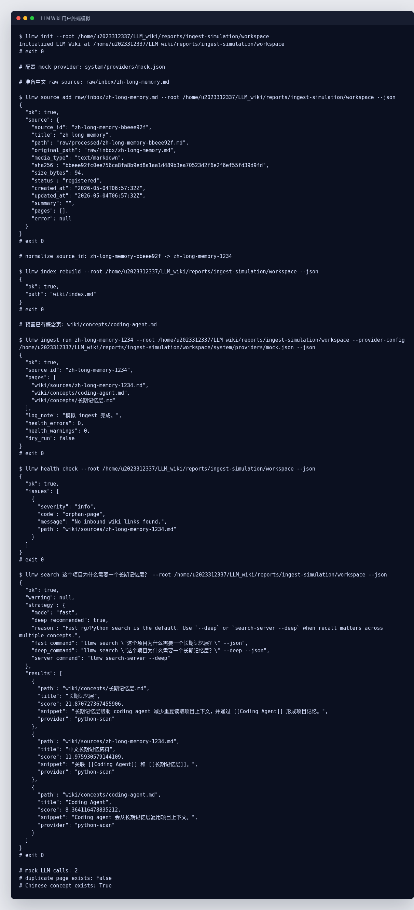

# Ingest 修复用户体验模拟报告

生成时间：2026-05-04 14:59 CST

## 一句话结论

从用户视角完整跑了一遍：初始化项目、添加中文 raw source、执行 `llmw ingest run`、检查 health、用中文自然语言搜索。结果显示 JSON repair、重复页复用、中文概念路径、中文搜索都按预期工作。

## 终端截图



原始终端 transcript：[`reports/ingest-simulation/terminal-transcript.txt`](ingest-simulation/terminal-transcript.txt)

## 模拟方式

这次不是单纯调用 Python 函数，而是按用户会看到的 CLI 流程执行真实命令：

1. `llmw init`
2. `llmw source add ... --json`
3. `llmw index rebuild --json`
4. `llmw ingest run ... --json`
5. `llmw health check --json`
6. `llmw search "这个项目为什么需要一个长期记忆层？" --json`

为了避免真实 LLM 成本和不稳定性，模拟中启动了一个本地 mock OpenAI-compatible API：

- 第一次 chat 返回非 JSON：用于模拟之前遇到的模型输出格式错误。
- 第二次 chat 返回合法 JSON：用于验证 repair retry 是否生效。

模拟 workspace 位于：

```text
reports/ingest-simulation/workspace
```

## 用户看到的关键结果

`llmw ingest run` 成功返回：

```json
{
  "ok": true,
  "source_id": "zh-long-memory-1234",
  "pages": [
    "wiki/sources/zh-long-memory-1234.md",
    "wiki/concepts/coding-agent.md",
    "wiki/concepts/长期记忆层.md"
  ],
  "log_note": "模拟 ingest 完成。",
  "health_errors": 0,
  "health_warnings": 0,
  "dry_run": false
}
```

这里验证了三个关键点：

- source page 路径被纠正为 `wiki/sources/zh-long-memory-1234.md`。
- 模型想写 `wiki/concepts/Coding_Agent.md`，实际复用了已有的 `wiki/concepts/coding-agent.md`。
- 中文概念按 title 生成了 `wiki/concepts/长期记忆层.md`。

中文搜索 Top 1 命中：

```text
wiki/concepts/长期记忆层.md | 长期记忆层 | provider=python-scan
```

额外检查：

```text
mock LLM calls: 2
duplicate page exists: False
Chinese concept exists: True
```

## Health 结果说明

`llmw health check --json` 返回 `ok: true`，没有 error 或 warning。输出里有一个 `info` 级别的 `orphan-page`：

```text
wiki/sources/zh-long-memory-1234.md
```

这是当前 health check 的正常提示：source page 暂时没有 inbound wiki link，不代表失败。`ingest run` 返回的 `health_errors=0`、`health_warnings=0` 是关键状态。

## 覆盖的问题

本次用户体验模拟覆盖了之前提到的主要问题：

- 非 JSON LLM 响应不会直接终止流程，会触发一次 repair。
- repair 使用低随机性设置，降低再次输出解释文本的概率。
- source page 不会因模型路径漂移而写错。
- `Coding_Agent.md` / `coding-agent.md` 这类重复概念页不会继续产生。
- 中文概念可以生成中文路径。
- 中文自然语言查询可以召回中文概念页。

## 产物

- 截图：[`reports/ingest-simulation/terminal-user-experience.png`](ingest-simulation/terminal-user-experience.png)
- Transcript：[`reports/ingest-simulation/terminal-transcript.txt`](ingest-simulation/terminal-transcript.txt)
- HTML 渲染源：[`reports/ingest-simulation/terminal-user-experience.html`](ingest-simulation/terminal-user-experience.html)
- 复现脚本：[`reports/ingest-simulation/run_user_experience_demo.py`](ingest-simulation/run_user_experience_demo.py)

## 剩余风险

- 真实模型仍可能返回 JSON 合法但内容质量不足的页面，这需要后续内容质量验证。
- 已经存在的历史重复页不会自动合并；当前修复重点是防止新重复页继续产生，并通过 health warning 暴露重复风险。
- 中文 benchmark 还没有加入默认 102 个公开用例，因为主 wiki 目前没有稳定中文页面集。
