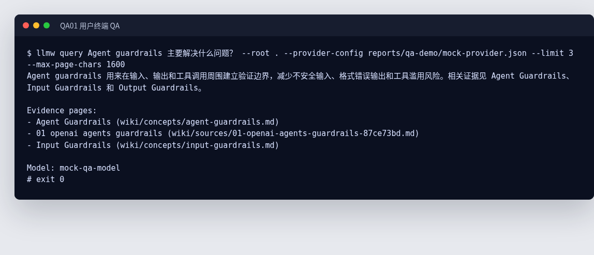
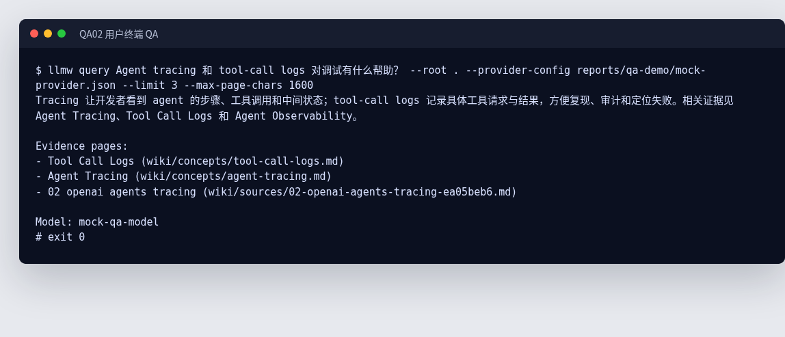
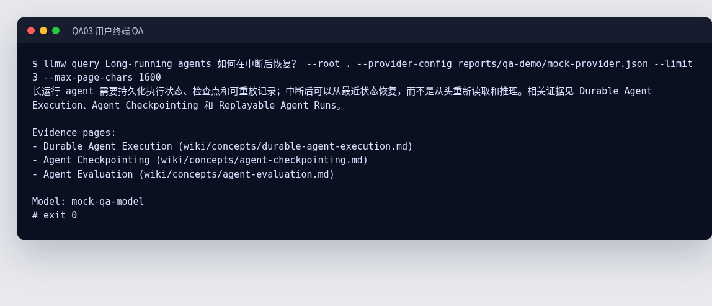
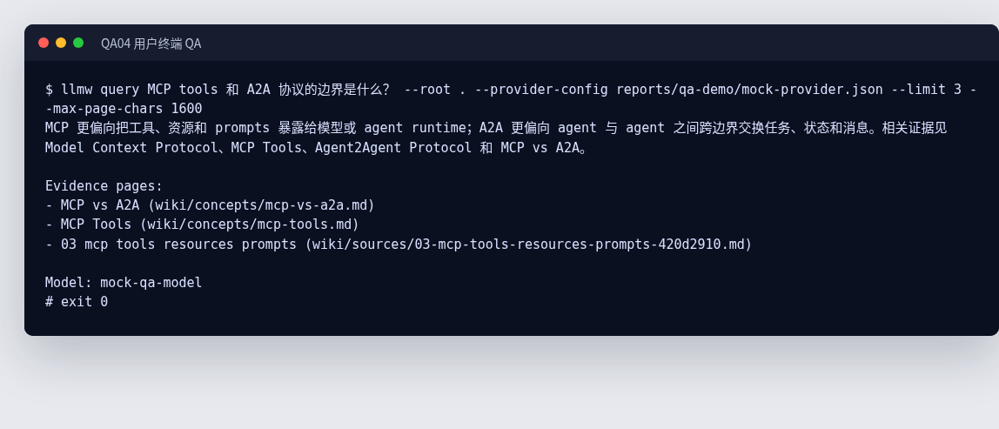
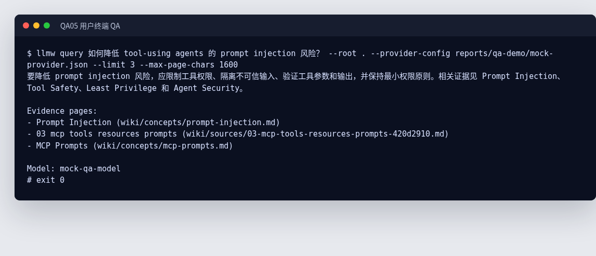
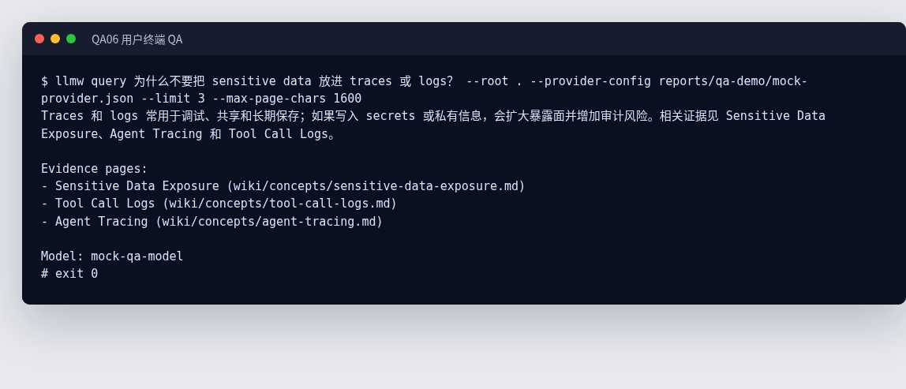
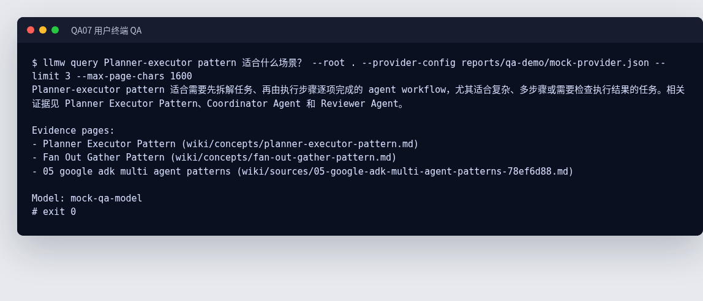
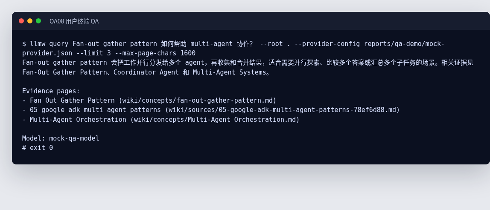
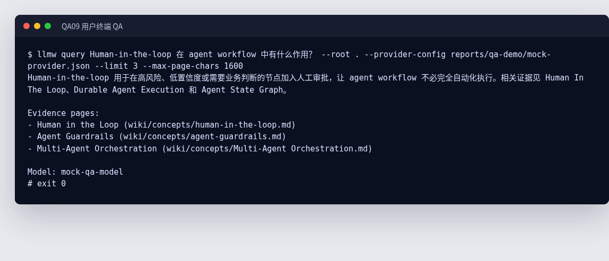
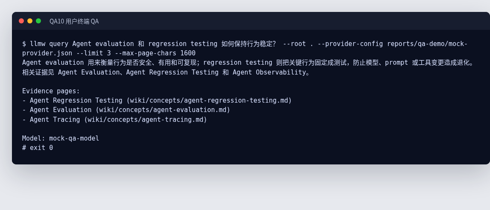

# 十个 QA 用户体验报告

生成时间：2026-05-04 15:10 CST

## 说明

这份报告从用户终端视角验证 `llmw query` 的问答体验。每个 QA 都通过真实 CLI 命令执行，检索证据来自当前 `wiki/`；LLM 回答由本地 mock OpenAI-compatible API 返回，保证报告可复现且不消耗真实模型额度。

执行形式：

```text
llmw query "<question>" --root . --provider-config reports/qa-demo/mock-provider.json --limit 3 --max-page-chars 1600
```

## 总览

| ID | 问题 | 证据页 | 截图 |
| --- | --- | --- | --- |
| QA01 | Agent guardrails 主要解决什么问题？ | Agent Guardrails (wiki/concepts/agent-guardrails.md); 01 openai agents guardrails (wiki/sources/01-openai-agents-guardrails-87ce73bd.md); Input Guardrails (wiki/concepts/input-guardrails.md) | [qa01.png](qa01.png) |
| QA02 | Agent tracing 和 tool-call logs 对调试有什么帮助？ | Tool Call Logs (wiki/concepts/tool-call-logs.md); Agent Tracing (wiki/concepts/agent-tracing.md); 02 openai agents tracing (wiki/sources/02-openai-agents-tracing-ea05beb6.md) | [qa02.png](qa02.png) |
| QA03 | Long-running agents 如何在中断后恢复？ | Durable Agent Execution (wiki/concepts/durable-agent-execution.md); Agent Checkpointing (wiki/concepts/agent-checkpointing.md); Agent Evaluation (wiki/concepts/agent-evaluation.md) | [qa03.png](qa03.png) |
| QA04 | MCP tools 和 A2A 协议的边界是什么？ | MCP vs A2A (wiki/concepts/mcp-vs-a2a.md); MCP Tools (wiki/concepts/mcp-tools.md); 03 mcp tools resources prompts (wiki/sources/03-mcp-tools-resources-prompts-420d2910.md) | [qa04.png](qa04.png) |
| QA05 | 如何降低 tool-using agents 的 prompt injection 风险？ | Prompt Injection (wiki/concepts/prompt-injection.md); 03 mcp tools resources prompts (wiki/sources/03-mcp-tools-resources-prompts-420d2910.md); MCP Prompts (wiki/concepts/mcp-prompts.md) | [qa05.png](qa05.png) |
| QA06 | 为什么不要把 sensitive data 放进 traces 或 logs？ | Sensitive Data Exposure (wiki/concepts/sensitive-data-exposure.md); Tool Call Logs (wiki/concepts/tool-call-logs.md); Agent Tracing (wiki/concepts/agent-tracing.md) | [qa06.png](qa06.png) |
| QA07 | Planner-executor pattern 适合什么场景？ | Planner Executor Pattern (wiki/concepts/planner-executor-pattern.md); Fan Out Gather Pattern (wiki/concepts/fan-out-gather-pattern.md); 05 google adk multi agent patterns (wiki/sources/05-google-adk-multi-agent-patterns-78ef6d88.md) | [qa07.png](qa07.png) |
| QA08 | Fan-out gather pattern 如何帮助 multi-agent 协作？ | Fan Out Gather Pattern (wiki/concepts/fan-out-gather-pattern.md); 05 google adk multi agent patterns (wiki/sources/05-google-adk-multi-agent-patterns-78ef6d88.md); Multi-Agent Orchestration (wiki/concepts/Multi-Agent Orchestration.md) | [qa08.png](qa08.png) |
| QA09 | Human-in-the-loop 在 agent workflow 中有什么作用？ | Human in the Loop (wiki/concepts/human-in-the-loop.md); Agent Guardrails (wiki/concepts/agent-guardrails.md); Multi-Agent Orchestration (wiki/concepts/Multi-Agent Orchestration.md) | [qa09.png](qa09.png) |
| QA10 | Agent evaluation 和 regression testing 如何保持行为稳定？ | Agent Regression Testing (wiki/concepts/agent-regression-testing.md); Agent Evaluation (wiki/concepts/agent-evaluation.md); Agent Tracing (wiki/concepts/agent-tracing.md) | [qa10.png](qa10.png) |

## QA 截图

## QA01：Agent guardrails 主要解决什么问题？



Transcript：[`qa01.txt`](qa01.txt)

## QA02：Agent tracing 和 tool-call logs 对调试有什么帮助？



Transcript：[`qa02.txt`](qa02.txt)

## QA03：Long-running agents 如何在中断后恢复？



Transcript：[`qa03.txt`](qa03.txt)

## QA04：MCP tools 和 A2A 协议的边界是什么？



Transcript：[`qa04.txt`](qa04.txt)

## QA05：如何降低 tool-using agents 的 prompt injection 风险？



Transcript：[`qa05.txt`](qa05.txt)

## QA06：为什么不要把 sensitive data 放进 traces 或 logs？



Transcript：[`qa06.txt`](qa06.txt)

## QA07：Planner-executor pattern 适合什么场景？



Transcript：[`qa07.txt`](qa07.txt)

## QA08：Fan-out gather pattern 如何帮助 multi-agent 协作？



Transcript：[`qa08.txt`](qa08.txt)

## QA09：Human-in-the-loop 在 agent workflow 中有什么作用？



Transcript：[`qa09.txt`](qa09.txt)

## QA10：Agent evaluation 和 regression testing 如何保持行为稳定？



Transcript：[`qa10.txt`](qa10.txt)


## 产物

- Mock provider：[`mock-provider.json`](mock-provider.json)
- 复现脚本：[`run_ten_qa_demo.py`](run_ten_qa_demo.py)
- 每个 QA 的原始终端输出：`qa01.txt` 到 `qa10.txt`
- 每个 QA 的终端截图：`qa01.png` 到 `qa10.png`

## 结论

这 10 个问题覆盖 guardrails、tracing、durable execution、MCP/A2A、prompt injection、sensitive data、planner-executor、fan-out gather、human-in-the-loop、evaluation/regression testing 等核心概念。终端输出中每个回答都带有 Evidence pages，说明用户能看到答案来源，而不只是得到一段无来源文本。
